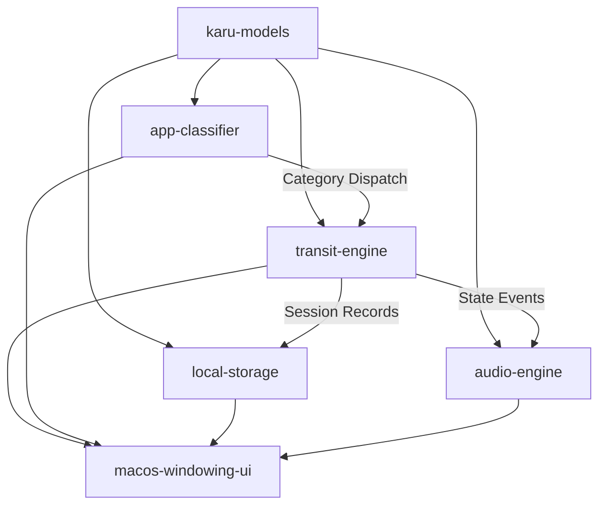

# Capability Map: Karu (macOS Habit & Focus Timer)

This document establishes the decoupled module boundaries, dependencies, and build order for Karu.

---

## 🗺️ Module Registry

| Module ID | Primary Responsibility | Input Boundary / Dependencies | Output Boundary / Consumers |
|---|---|---|---|
| `karu-models` | Core immutable domain models (`TransitState`, `TripSession`, `Habit`, `VehicleProfile`, `AppFilterRule`). | Standard Library, Foundation | All modules |
| `transit-engine` | Velocity calculation (100km/h vs 0km/h), elapsed cruise/stall time tracking, route progress, and pit stops. | `karu-models` | `macos-windowing-ui`, `audio-engine`, `local-storage` |
| `app-classifier` | $O(1)$ bundle ID classification (Focus / Distraction / Neutral) and event-driven `NSWorkspace` app listener. | `karu-models`, `AppKit.NSWorkspace` | `transit-engine` |
| `local-storage` | 100% local atomic JSON file persistence (`~/Library/Application Support/Karu/`) & auto-saving scratchpad store. | `karu-models`, `Foundation.FileManager` | `transit-engine`, `macos-windowing-ui` |
| `audio-engine` | `AVAudioEngine` low-latency ambient audio loops with 400ms crossfade between cruise and stall states. | `karu-models`, `AVFoundation` | `transit-engine`, `macos-windowing-ui` |
| `macos-windowing-ui` | `NSStatusItem` MenuBar popover, `NSPanel` Notch Wings (`auxiliaryTopLeftArea`), Floating HUD, and SwiftUI views. | `transit-engine`, `app-classifier`, `local-storage`, `audio-engine` | End User (macOS Desktop) |

---

## 🔗 Dependency Graph & Build Order

### Approved Build Order:
1. `karu-models`
2. `transit-engine`
3. `app-classifier`
4. `local-storage`
5. `audio-engine`
6. `macos-windowing-ui`
