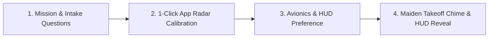

# Idea: First-Time Pilot Pre-Flight Briefing & Workspace Intake

## Problem Statement
How might we transform a new user's first 60 seconds into an engaging, question-driven **"Pre-Flight Pilot Intake & Workspace Radar"** that personalizes their focus goals, auto-classifies their running macOS applications, and launches their maiden flight with zero cognitive friction?

---

## Recommended Direction: The 4-Stage Cockpit Intake Flow

An interactive, carbon-matte `#08080A` modal window (`NSWindow` / `.titled`, non-resizable, centered on main screen) that activates only once when `preferences.hasCompletedOnboarding == false`.

### 1. Stage 1: Mission Intake & Daily Flight Quota
- **Interactive Question Prompt:** *"Welcome to the Cockpit, Pilot. What is your primary mission?"*
  - 🛠️ **Deep Engineering / Coding** (Preset: Developer — Xcode, VS Code, Cursor, Terminal, Git)
  - ✍️ **Writing & Knowledge Craft** (Preset: Writer — Obsidian, Notion, Ulysses, Docs)
  - 🎓 **Deep Study & Academic Sprint** (Preset: Student — Anki, PDF readers, Notes)
  - 🎨 **Creative / Product Design** (Preset: Designer — Figma, Sketch, Blender)
- **Target Flight Hours Slider / Selection:**
  - `2 Hours (1,080 NM)` — Light Commute
  - `4 Hours (2,160 NM)` — Transcontinental Focus *(Recommended)*
  - `6+ Hours (3,240 NM)` — Supersonic Long-Haul

### 2. Stage 2: 1-Click Running App Radar Auto-Tune
- Instantly detects currently open applications via `NSWorkspace.shared.runningApplications`.
- Presents a 2-column live radar grid with native high-res app icons:
  - 🟢 **Approved Focus Workspaces:** Auto-selected based on the user's answer in Stage 1.
  - 🔴 **Turbulence Hazards:** Auto-selected known distractions (Discord, Twitter/X, Steam, Slack).
- **1-Click Rule Adjustments:** Pilots can toggle any app between Focus, Hazard, or Neutral with a single click before their first flight.

### 3. Stage 3: Cockpit Telemetry & HUD Briefing
- **Core Mental Model Visualizer:**
  - ✈️ **Focus Workspace:** Cruising at **540 kts** (time & distance count toward flight logbook).
  - ⚠️ **Distraction Hazard:** Gridlock stall at **0 kts** (cabin seatbelt chime sounds, turbulence logged).
- **HUD Placement Quick Toggle:**
  - `[x] Menu Bar Dropdown` (Always on)
  - `[x] Floating Cockpit Card` (`Cmd + Shift + F`)
  - `[x] Hardware Notch Wings` (If supported display)
  - `[x] Dynamic Dock Icon Telemetry` (`NSDockTile`)

### 4. Stage 4: Maiden Flight Authorization (Clear for Takeoff)
- Big glowing amber/cyan ignition button: **"AUTHORIZE MAIDEN TAKEOFF 🛫"**.
- Triggers:
  - Spatial audio cabin chime & departure announcement.
  - Starts first 25-minute sprint flight (`SFO ✈ HND`).
  - Gracefully fades the onboarding window out and centers the Floating HUD.
  - Atomically writes `hasCompletedOnboarding: true` to `preferences.json`.

---

## Key Assumptions to Validate

- [ ] **Assumption 1 (Speed to Takeoff):** The 4-step flow can be completed in `< 45 seconds` without feeling like boring enterprise configuration.
  - *Validation:* Measure completion rate and time-to-first-flight in local builds.
- [ ] **Assumption 2 (Radar Accuracy):** Auto-classifying active apps based on user role answers produces >90% accurate default rules.
  - *Validation:* Test against top 20 developer, student, and creative apps on macOS Sonoma & Sequoia.
- [ ] **Assumption 3 (Metaphor Clarity):** New users immediately understand why their speed dropped to 0 kts when they open a distraction app.
  - *Validation:* Add a subtle onboard tooltip during the first turbulence encounter ("⚠️ Airspeed stalled to 0 kts — return to Xcode/VS Code to resume cruise").

---

## MVP Scope

### In Scope
1. `OnboardingView.swift` & `OnboardingWindowController.swift` in `Sources/Karu/UI/Onboarding/`.
2. Interactive question prompts for role/preset selection and daily flight hour goal.
3. 1-Click live running app scanner embedding native macOS icons and 1-tap classification toggles.
4. Audio chime and dynamic maiden flight start on completion.
5. Atomic persistence of `hasCompletedOnboarding` flag in `LocalStorageManager`.
6. Menu command "Replay Cockpit Briefing..." in Help/Settings for pilot retraining.

### Out of Scope / Not Doing (and Why)
- **Multi-page slide decks or video tutorials:** Avoid static carousel slides; users learn by touching the controls and taking off immediately.
- **Mandatory account creation / cloud login:** Violates Karu's 100% Local-First zero-cloud privacy architecture.
- **Forced accessibility permission hijacking:** Only request standard system notifications/audio; never block the user on intrusive system permissions.

---

## Open Questions for Build Integration

1. Should the Onboarding window be accessible anytime via Menu Bar -> `Help -> "Pre-Flight Cockpit Briefing..."`? *(Recommended: Yes)*
2. Should we include a mini 10-second "Turbulence Audio Test" button during onboarding so pilots hear what stall sounds like before their first flight? *(Recommended: Yes, gives immediate tactile feedback)*
